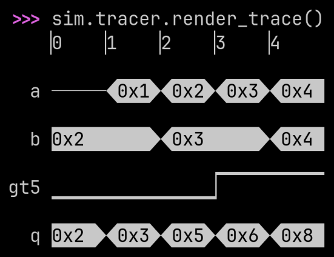

.. meta::
   :google-site-verification: sO_rsKD1QKb6nFywsuLnRDiz8Ekep-jVNpBDMm65wQc

=====
PyRTL
=====

PyRTL is a collection of classes that provide simple `RTL
<https://en.wikipedia.org/wiki/Register-transfer_level>`_ specification,
simulation, tracing, and testing, suitable for teaching and research.
Simplicity, usability, clarity, and extensibility are overarching goals, rather
than performance or optimization. With PyRTL you can use the full power of
Python to describe complex synthesizable digital designs, simulate and test
them, and export them to `Verilog <https://en.wikipedia.org/wiki/Verilog>`_.

Quick links
===========
* Get an overview from the `PyRTL Project Webpage <http://ucsbarchlab.github.io/PyRTL/>`_
* See some `PyRTL Examples <https://github.com/UCSBarchlab/PyRTL/tree/development/examples>`_
* File a `Bug Report or Issue <https://github.com/UCSBarchlab/PyRTL/issues>`_
* Contribute to the project on `GitHub <https://github.com/UCSBarchlab/PyRTL>`_

Installation
============

PyRTL is availble in `PyPI <http://pypi.python.org/pypi/pyrtl>`_ and can be
installed with :program:`pip`::

    $ pip install pyrtl

Design, Simulate, and Inspect in 15 lines
=========================================

.. code-block::
    :linenos:

    import pyrtl

    a = pyrtl.Input(name="a", bitwidth=8)  # Input "pins".
    b = pyrtl.Input(name="b", bitwidth=8)
    q = pyrtl.Output(name="q", bitwidth=8)  # Output "pins".
    gt5 = pyrtl.Output(name="gt5", bitwidth=1)

    result = a + b  # Makes an 8-bit adder.
    q <<= result  # Assigns output of adder to output pin.
    gt5 <<= result > 5  # Compare and assign result to output pin.

    # Simulate and display waveforms in the terminal.
    sim = pyrtl.Simulation()
    sim.step_multiple({"a": [0, 1, 2, 3, 4], "b": [2, 2, 3, 3, 4]})
    sim.tracer.render_trace()

After installing PyRTL, you can copy and paste the code above into a Python
interpreter. You should see simulation waveforms drawn right in your terminal:

Line 14's call to :meth:`.Simulation.step_multiple` runs the simulation for
five cycles, providing input values for ``a`` and ``b`` for each cycle. For
example, in the second cycle, ``a`` will be ``1`` and ``b`` will be ``2``. The
five cycles are numbered ``0`` to ``4`` in the first line displayed by
:meth:`~.SimulationTrace.render_trace`.

:meth:`~.SimulationTrace.render_trace`'s last line shows that ``q`` is ``0x3``
in the second cycle, which is the result of computing ``a + b``. And the
second-to-last line shows that ``gt5`` is low in the second cycle, which is the
result of computing ``a + b > 5``.

While a great deal of work has gone into making hardware design in PyRTL as
friendly as possible, please don't mistake that for a lack of depth. You can
just as easily export to Verilog or other hardware formats, view results with
your favorite waveform viewer, build hardware transformation passes, run
JIT-accelerated simulations, design, test, verify hugely complex digital
systems, and much more. Most critically of all it is easy to extend with your
own approaches to digital hardware development as you find necessary.

Overview of PyRTL
=================

If you are brand new to PyRTL we recommend that you start with the `PyRTL Code
Examples <https://github.com/UCSBarchlab/PyRTL/tree/development/examples>`_
which will show you most of the core functionality in the context of a complete
design.

``WireVectors``
---------------

Perhaps the most important class to understand is :class:`.WireVector`, which is the
basic type from which you build all hardware. If you are coming to PyRTL from Verilog, a
:class:`.WireVector` is closest to a multi-bit `wire`. Every new :class:`.WireVector`
builds a set of wires which you can then connect with other :class:`.WireVector` through
overloaded operations such as :meth:`~.WireVector.__add__` or
:meth:`~.WireVector.__or__`.

A bunch of other related classes, including :class:`.Input`, :class:`.Output`,
:class:`.Const`, and :class:`.Register` are all derived from
:class:`.WireVector`. Coupled with :class:`.MemBlock` (and :class:`.RomBlock`),
this is all a user needs to create a functional hardware design.

.. inheritance-diagram:: pyrtl.WireVector
                         pyrtl.Input
                         pyrtl.Output
                         pyrtl.Const
                         pyrtl.Register
    :parts: 1

After specifying a hardware design, there are then options to simulate your
design right in PyRTL, synthesize it down to primitive 1-bit operations,
optimize it, and export it to Verilog (along with a testbench).

Simulation
----------

PyRTL provides tools for simulation and viewing simulation traces. Simulation
is how your hardware is "executed" for the purposes of testing, and three
different classes help you do that: :class:`.Simulation`,
:class:`.FastSimulation` and :class:`.CompiledSimulation`.  All three have
`almost` the same interface and, except for a few debugging cases, can be used
interchangeably.  Typically one starts with :class:`.Simulation` and then moves
up to :class:`.FastSimulation` when performance begins to matter.

Both :class:`.Simulation` and :class:`.FastSimulation` store a list of each
wire's value in each cycle in :attr:`.Simulation.tracer`, which is an instance
of :class:`.SimulationTrace`. Traces can then be rendered to the terminal with
:meth:`.SimulationTrace.render_trace`.
:class:`SimulationTraces<.SimulationTrace>` can be handled in other ways, for
example they can be extracted as a test bench with
:func:`.output_verilog_testbench`, or exported to a VCD file with
:meth:`~.SimulationTrace.print_vcd`.

Optimization
------------

:class:`.WireVector` and :class:`.MemBlock` are just "sugar" over a core set of
primitives, and the final design is built up incrementally as a graph of these
primitives. :class:`WireVectors<.WireVector>` connects these "primitives",
which connect to other :class:`WireVectors<.WireVector>`. Each primitive is a
:class:`.LogicNet`, and a :class:`.Block` is a graph of
:class:`LogicNets<.LogicNet>`. Typically a full design is stored in a single
:class:`.Block`.  The function :func:`.working_block()` returns the block on
which we are implicitly working.  Hardware transforms may make a new
:class:`.Block` from an old one. For example, see :class:`.PostSynthBlock`.

Errors
------

Finally, when things go wrong you may hit an :class:`Exception`, neither of which is
likely recoverable automatically (which is why we limited them to only two types).
:class:`.PyrtlError` is intended to capture end user errors such as invalid constant
strings and mis-matched bitwidths. In contrast, :class:`.PyrtlInternalError` captures
internal invariants and assertions over the core logic graph which should never be
encountered when constructing designs in the normal ways. If you hit a confusing
:class:`.PyrtlError` or any :class:`.PyrtlInternalError` feel free to file an issue.

.. autoclass:: pyrtl.PyrtlError
    :members:

.. autoclass:: pyrtl.PyrtlInternalError
    :members:

A Few Gotchas
=============

While Python is an amazing language, DSLs in Python are always forced to make a
few compromises which can sometimes catch users in some unexpected ways. Watch
out for these "somewhat surprising features":

* PyRTL never uses any of the "in-place arithmetic assignments" such as ``+=``
  or ``&=`` in the traditional ways. Instead only ``<<=`` and ``|=`` are
  defined and they are used for wire-assignment and conditional-wire-assignment
  respectively (more on both of these in `Example 3
  <https://github.com/UCSBarchlab/PyRTL/blob/development/examples/example3-statemachine.py>`_).

  If you declare::

      x = WireVector(bitwidth=3)

  and::

      y = WireVector(bitwidth=5)

  how do you assign ``x`` the value of ``y + 1``? If you do ``x = y + 1`` that
  will replace the old definition of ``x`` entirely. Instead you need to write
  ``x <<= y + 1`` which you can read as "``x`` gets its value from ``y + 1``".

* The example above also shows off another aspect of PyRTL. The
  :attr:`~.WireVector.bitwidth` of ``y`` is 5. The :attr:`~.WireVector.bitwidth`
  of ``y + 1`` is actually 6 (PyRTL infers this automatically). But then when
  you assign ``x <<= y + 1`` you are taking a 6-bit value and assigning it to a
  3-bit value. This is completely legal, and the value will be :meth:`truncated
  <.WireVector.truncate>`, so only the least significant bits will be assigned.
  Mind your bitwidths!

* PyRTL's :class:`WireVectors <.WireVector>` overloads many useful operators,
  including ``==`` and ``<`` which evaluate to a new :class:`~.WireVector` with
  :attr:`~.WireVector.bitwidth` 1 to hold the result of the comparison. The
  bitwise operators ``&``, ``|``, ``~`` and ``^`` are also defined (however
  logic operations such as ``and`` and ``not`` are not defined). A really
  tricky gotcha happens when you start combining these operators. Consider::

      do_it = ready & state == 3

  In Python, the bitwise ``&`` operator has `higher precedence
  <https://docs.python.org/3/reference/expressions.html#operator-precedence>`_
  than ``==``, thus Python parses this as::

      do_it = (ready & state) == 3

  which is probably not what you intended! Make sure to use parentheses when
  using comparisons with logic operations to be clear::

      do_it = ready & (state == 3)

* In PyRTL, all :class:`WireVectors <.WireVector>` are `unsigned`, so
  :class:`~.WireVector` comparisons with ``<`` are unsigned comparisons. You
  must explicitly call functions like :func:`~.signed_lt` for signed
  comparisons. Similarly, if you pass a :class:`~.WireVector` to a function
  that requires more bits that you have provided, the :class:`~.WireVector`
  will be zero-extended by default. You must explicitly call
  :meth:`~.WireVector.sign_extended` to sign-extend. `Example 1.1
  <https://github.com/UCSBarchlab/PyRTL/blob/development/examples/example1.1-signed-numbers.py>`_
  provides more examples of signed arithmetic in PyRTL.

Related Projects
================

`Amaranth (previously nMigen) <https://github.com/amaranth-lang/amaranth>`_
    Another Python hardware project providing an open-source toolchain that has
    a lot of wonderful stuff for working with FPGAs in particular. It has
    support for evaluation board definitions, a System-on-Chip toolkit, and
    more. I think it has a similar philosophy of trying to be easy to learn and
    use and simplify the design of complex hardware with reusable components.
    Amaranth (at the time of writing) has much better support on the back end
    for a variety of real devices and low level stuff like managing clock
    domains, but I think PyRTL provides some value in getting going right in
    the command line and how it handles memories etc. I would be eager to see
    the power of these tools combined in some way!

`Chisel <https://www.chisel-lang.org/>`_
    A project with similar goals to PyRTL but based on Scala instead of Python.
    Scala provides some very helpful embedded language features and a rich type
    system. Chisel is (like PyRTL) a elaborate-through-execution hardware
    design language. With support for signed types, named hierarchies of wires
    useful for hardware protocols, which inspired our :func:`.wire_struct`,
    and a neat control structure call ``when`` that inspired our
    :data:`~.conditional_assignment` contexts, Chisel is a powerful tool used
    in some great research projects including RISC-V. Unlike Chisel, PyRTL has
    concentrated on a simple to use and complete tool chain which is useful for
    instructional projects, and provides a clearly defined and relatively
    easy-to-manipulate intermediate structure in the class :class:`~.Block`
    which allows rapid prototyping of hardware analysis routines which can then
    be co-designed with the architecture.

`SpinalHDL <https://github.com/SpinalHDL/SpinalHDL>`_
    A different approach to HDL in Scala, very much aligned with the way PyRTL
    is built. Invented independently, it is neat to see the convergent
    evolution which, I think, points to something deeper about hardware design.
    It has a lot of support and really well thought out structures.

`MyHDL <http://www.myhdl.org/>`_
    Another neat Python hardware project built around generators and
    decorators. The semantics of this embedded language are close to Verilog
    and unlike PyRTL, MyHDL allows asynchronous logic and higher level
    modeling. Much like Verilog, only a structural "convertible subset" of the
    language can be automatically synthesized into real hardware. PyRTL
    requires all logic to be both synchronous and synthesizable which avoids a
    common trap for beginners, it elaborates the design during execution
    allowing the full power of Python in describing recursive or complex
    hardware structures, and it allows for hardware synthesis, simulation, test
    bench creation, and optimization all in the same framework.

`Yosys <https://yosyshq.net/yosys/>`_
    An open source tool for Verilog RTL synthesis. It supports a huge subset of
    Verilog-2005 and provides a basic set of synthesis algorithms. The goals of
    this tool are quite different from PyRTL, but the two play together very
    nicely. PyRTL's :func:`~.output_to_verilog` produces Verilog that can be
    synthesized with Yosys. Similarly, PyRTL's :func:`~.input_from_verilog`
    uses Yosys to synthesize complex Verilog designs to a simple library of
    gates, before importing into PyRTL.

`PyMTL3 (a.k.a. Mamba) <https://pymtl.github.io/>`_
    A beta stage "open-source Python-based hardware generation, simulation, and
    verification framework with multi-level hardware modeling support". One of
    the neat things about this project is that they are trying to allow
    simulation, modeling, and verification at multiple different levels of the
    design from the functional level, the cycle-close level, and down to the
    register-transfer level (where PyRTL really is built to play). Like MyHDL
    they do some meta-programming tricks like parsing the Python AST to allow
    executable software descriptions to be (under certain restrictions, sort of
    like Verilog) automatically converted into implementable hardware. PyRTL,
    on the other hand, is about providing a limited and composable set of data
    structures for specifying an RTL implementation, thus avoiding the
    distinction between synthesizable and non-synthesizable code (the execution
    is the elaboration step).

`ClaSH <http://www.clash-lang.org/>`_
    An embedded hardware description language in Haskell. Like PyRTL it
    provides an approach suitable for both combinational and synchronous
    sequential circuits and transforms these high-level descriptions to
    low-level synthesizable Verilog HDL. Unlike PyRTL, designs are statically
    typed (like VHDL), yet with a very high degree of type inference, enabling
    both safe and fast prototying using concise descriptions. If you like
    functional programming and hardware also check out `Lava
    <https://raintown.org/lava/>`_.

Reference Guide
===============
.. toctree::
   :maxdepth: 2

   basic
   regmem
   simtest
   helpers
   blocks
   analysis
   export
   rtllib
   PyRTL on GitHub <https://github.com/UCSBarchlab/pyrtl>

Index
=====
* :ref:`genindex`
