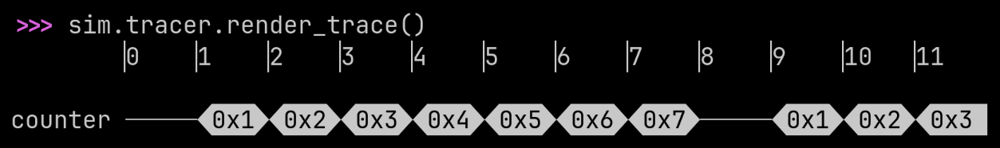

.. meta::
   :google-site-verification: ls9UjPExLzNwr4BVvQ_THSjcGqyNM-KO9Rs9njbX318

.. card::
   :text-align: center
   :class-card: title-card

   .. image:: ../docs/brand/pyrtl_logo.png

   .. container:: tagline

      register-transfer-level hardware design and simulation

   .. grid:: 1 2 2 4
      :gutter: 2

      .. grid-item::

         .. button-link:: http://pyrtl.readthedocs.org/
            :color: secondary
            :expand:
            :shadow:

            Documentation

      .. grid-item::

         .. button-link:: https://github.com/UCSBarchlab/pyrtl
            :color: secondary
            :expand:
            :shadow:

            GitHub

      .. grid-item::

         .. button-link:: https://github.com/UCSBarchlab/PyRTL/tree/development/examples
            :color: secondary
            :expand:
            :shadow:

            Examples

      .. grid-item::

         .. button-link:: https://mybinder.org/v2/gh/UCSBarchlab/PyRTL/development?filepath=%2Fipynb-examples%2F
            :color: secondary
            :expand:
            :shadow:

            Notebooks

PyRTL
=====

PyRTL is a Python library for register-transfer-level hardware design and
simulation. Get started with:

.. code-block:: shell

    $ pip install pyrtl

Features
========

PyRTL provides a collection of classes for Pythonic `register-transfer level
<https://en.wikipedia.org/wiki/Register-transfer_level>`_ design, simulation,
tracing, and testing suitable for teaching and research. Simplicity, usability,
clarity, and extensibility are overarching goals, rather than performance or
optimization. Features include:

* Elaboration-through-execution, meaning all of Python can be used, including
  introspection.
* Design, instantiate, and simulate all in one file, and without leaving Python.
* Export to, or import from, common HDLs (BLIF-in, Verilog-out currently
  supported).
* Examine execution with waveforms in a terminal or export to `.vcd
  <https://en.wikipedia.org/wiki/Value_change_dump>`_ as projects scale.
* Elaboration, synthesis, and basic optimizations all included.
* Small and well-defined internal core structure means writing new transforms
  is easier.
* Batteries included means many useful components are already available.

.. card:: :octicon:`rocket` New in `PyRTL 1.0.0 <https://pypi.org/project/pyrtl/>`_

   The new :mod:`pyrtl.rtllib.float` module generates floating point hardware!

Simple Examples
===============

Here are some simple examples of PyRTL in action. These examples implement the
same functionality as those highlighted in the wonderful related work `Chisel
<https://www.chisel-lang.org/>`_, which in turn allows us to see the stylistic
differences between the approaches.

.. grid:: 1 1 1 1
   :outline:

   .. grid-item::
      :columns: auto

      .. tab-set::
         .. tab-item:: GCD

            A greatest common denominator calculator: ``gcd`` generates a sequential
            circuit that saves inputs ``a`` and ``b`` when ``begin`` goes high, and
            then, while ``begin`` is low, calculates the GCD with `Euclid's algorithm
            <https://en.wikipedia.org/wiki/Euclidean_algorithm>`_. The function
            returns two :class:`WireVectors <pyrtl.WireVector>`, one which holds the
            GCD when the computation is ``done``, and the other which is a boolean
            ``done`` signal.

            The code below provides everything needed to instantiate, simulate, and
            visualize the resulting design.

            .. literalinclude:: examples/example-gcd.py

            .. image:: ../docs/screenshots/gcd.png
               :width: 16em

         .. tab-item:: FIR

            A finite impulse response filter: ``fir`` generates a sequential circuit
            that accepts inputs ``x`` and a list of coefficients ``bs``. From the
            `Wikipedia FIR description
            <https://en.wikipedia.org/wiki/Finite_impulse_response>`_, the list
            ``zs`` is the registers required to implement the delay. ``fir`` returns
            an output ``y`` which is the resulting sum of products and is valid every
            cycle (since the design is naturally fully pipelined).

            .. literalinclude:: examples/example-fir.py

            .. image:: ../docs/screenshots/fir.png
               :width: 30em

         .. tab-item:: MaxN

            ``max_n`` generates hardware that identifies the largest of N input
            values. This example makes use of Python's `notation for handling
            multiple inputs
            <https://docs.python.org/3/tutorial/controlflow.html#arbitrary-argument-lists>`_
            by packing them into a :class:`list`. It also demonstrates that the full
            power of Python is available to you in PyRTL, including functional tools
            like :func:`~functools.reduce`, which is used to chain together multiple
            ``max_2`` elements into a bigger ``max_n``.

            .. literalinclude:: examples/example-maxn.py

            .. image:: ../docs/screenshots/maxn.png
               :width: 15em

         .. tab-item:: Mul

            ``mul`` generates a small 4 x 4 multiplier with a simple `ROM
            <https://en.wikipedia.org/wiki/Read-only_memory>`_ lookup. The first two
            lines simply check that the inputs are each 4-bits wide. ``romdata`` is a
            Python function that calculates the values we want stored in the ROM, as
            a function of the ROM address. :class:`~pyrtl.RomBlock` automatically
            initializes the ROM with values computed by ``romdata``. The generated
            hardware simply :func:`concats <pyrtl.concat>` the two 4-bit inputs into
            an 8-bit ROM address and returns the value stored in the ROM at that
            address.

            .. literalinclude:: examples/example-mul.py

            .. image:: ../docs/screenshots/mul.png
               :width: 15em

         .. tab-item:: Adder

            The classic ripple-carry adder: ``adder`` generates a ripple carry adder
            of arbitrary length including both carry in and carry out. The `full
            adder <https://en.wikipedia.org/wiki/Adder_(electronics)#Full_adder>`_
            (``fa``) takes 1-bit inputs and produces 1-bit outputs. We iteratively
            create full adders and link the carry in of each new full adder to the
            carry out of the last full adder. ``adder``'s ``sum`` is a Python
            :class:`list` that keeps track of the wires carrying the sum bits. The
            final ``full_sum`` is produced by concatenating the wires in ``sum`` with
            :func:`~pyrtl.concat_list`.

            .. literalinclude:: examples/example-adder.py

            .. image:: ../docs/screenshots/adder.png
               :width: 15em

The 10,000 Foot Overview
========================

At a high level, PyRTL builds hardware that you `explicitly define`. If you are
looking for a tool to take your random Python code and turn it into hardware,
you will have to look elsewhere: this is `not` `HLS
<https://en.wikipedia.org/wiki/High-level_synthesis>`_. Instead, PyRTL helps
you concisely and precisely describe a digital hardware structure, which you
already have worked out in detail, in Python.

PyRTL restricts you to a set of reasonable digital designs practices: the clock
and resets are implicit, block memories are synchronous by default, there are
no "undriven" states, and un-registered feedback loops are not allowed. Instead
of worrying about these "analog-ish" tricks that are horrible ideas in modern
processes anyways, PyRTL lets you treat hardware design like a software
problem: build recursive hardware, write introspective containers, and have fun
building digital designs again!

To the user it provides a set of Python classes that allow them to Pythonically
express their hardware designs. For example, with :class:`~pyrtl.WireVector`
you get a structure that acts very much like a Python list of 1-bit wires, so
``mywire[:-1]`` selects everything except the most-significant-bit. Of course
you can :meth:`add <pyrtl.WireVector.__add__>`, :meth:`subtract
<pyrtl.WireVector.__sub__>`, and :meth:`multiply <pyrtl.WireVector.__mul__>`
these :class:`WireVectors <pyrtl.WireVector>`, or :func:`~pyrtl.concat` multiple
bit-vectors end-to-end as well.

You can even put :class:`WireVectors <pyrtl.WireVector>` in Python collections
and process them in bulk. For example, if ``x`` is a :class:`list` of
:class:`WireVectors <pyrtl.WireVector>`, and you want to multiply each of them
by 2 and sum them into a :class:`~pyrtl.WireVector` ``y``::

    y = sum([elem * 2 for elem in x])

Hardware comprehensions are surprisingly useful. We'll cover an example in more
detail below, but if you just want to play around with PyRTL `try Jupyter
Notebooks on any of our examples on MyBinder
<https://mybinder.org/v2/gh/UCSBarchlab/PyRTL/development?filepath=%2Fipynb-examples%2F>`_.

Hello N-bit Ripple-Carry Adder!
===============================

While adders are a builtin primitive for PyRTL, most people writing RTL are
familiar with `Ripple-Carry Adders
<https://en.wikipedia.org/wiki/Adder_(electronics)>`_ and so it is useful to
see how you might express one in PyRTL. Rather than the typical `Verilog
introduction to fixed 4-bit adders
<https://www.youtube.com/watch?v=bL3ihMA8_Gs>`_, let's go ahead and build an
`arbitrary` bitwidth adder.

.. literalinclude:: examples/example-ripple-carry.py

The code above includes ``ripple_add``, an adder generator with Python-style
slices on wires, ``counter``, an instance of :class:`~pyrtl.Register`, and all
the code needed to simulate the design, generate a waveform, and render it to
the terminal. `Example 2
<https://github.com/UCSBarchlab/PyRTL/blob/development/examples/example2-counter.py>`_
has more comments on how this code works. Running this code shows a counter
running from 0 to 7 and repeating:

